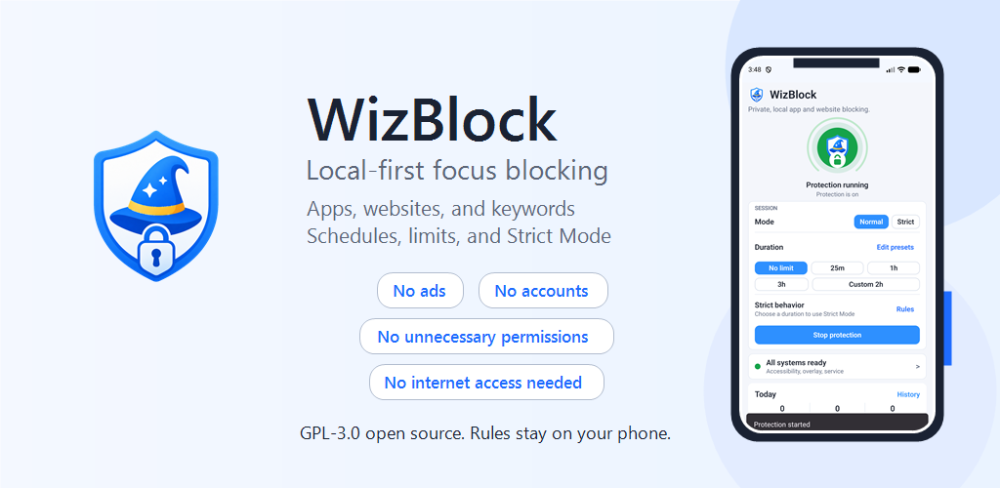
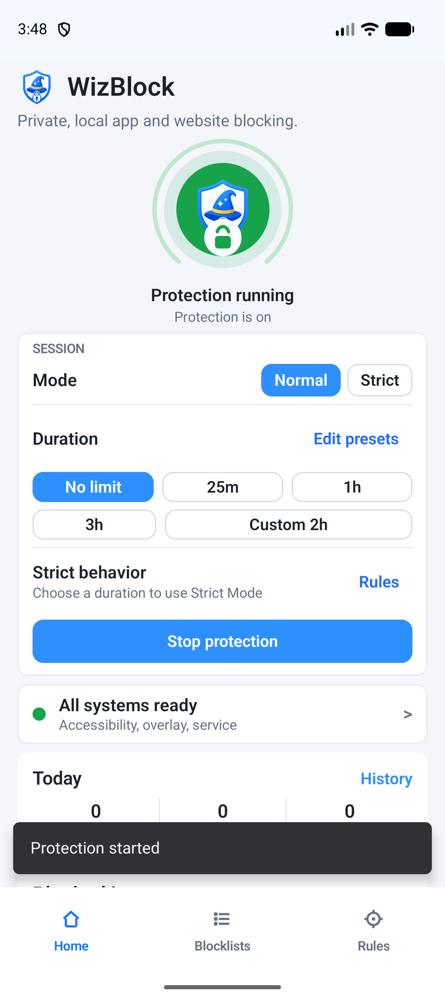
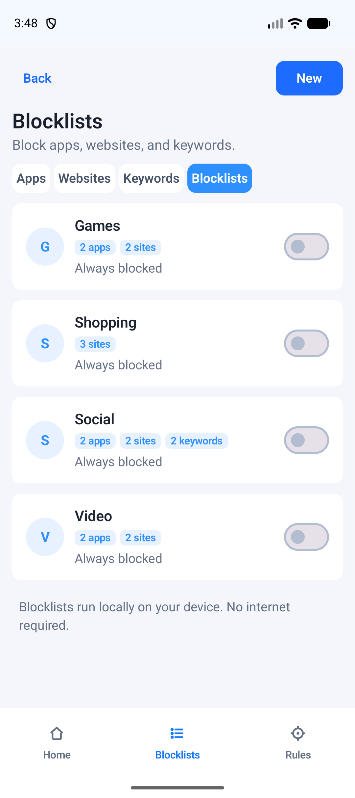
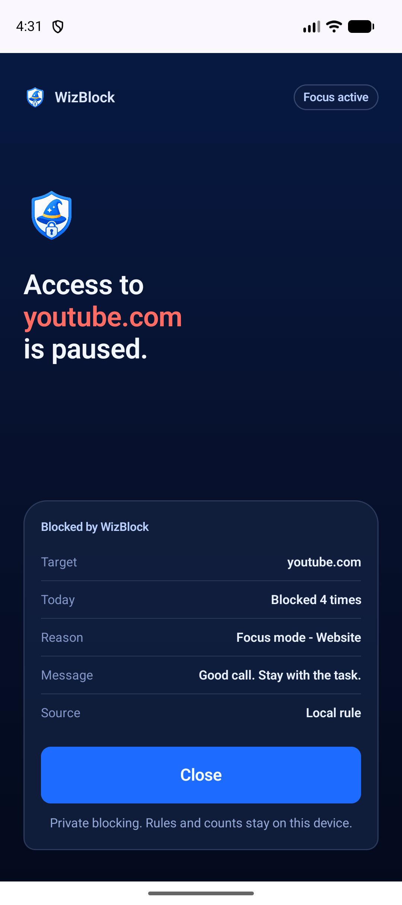
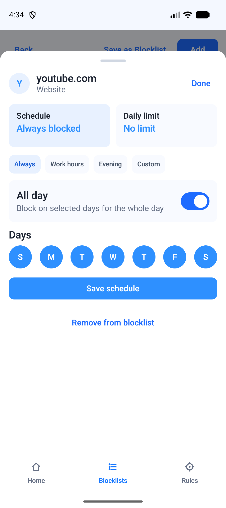
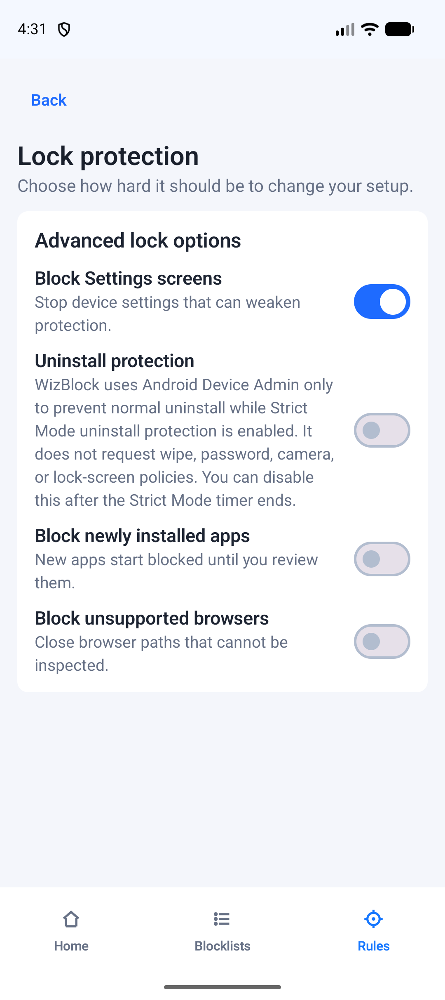
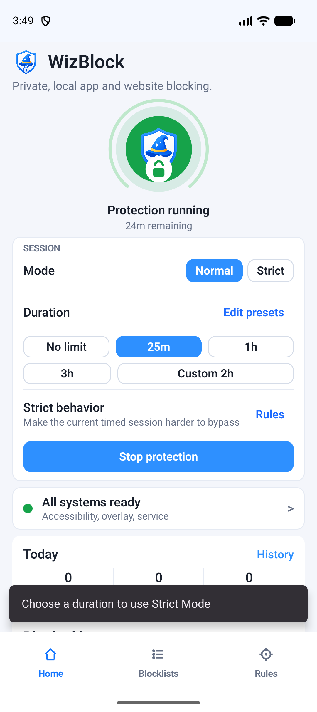

# WizBlock

WizBlock is a privacy-first Android focus blocker for apps, websites, keywords,
schedules, usage limits, and Strict Mode sessions.

It is built for people who want a serious blocker without accounts, ads,
analytics SDKs, cloud sync, upgrade pressure, or network-backed rule collection.
Rules, schedules, usage counters, and block history stay on the device.

WizBlock intentionally does not request `android.permission.INTERNET`.



## Download APK

Download the latest stable, precompiled APK from the [GitHub Releases page](https://github.com/kirentanna/WizBlock/releases/latest).
Each release includes a SHA-256 checksum and release notes so you can verify
what you are installing.

The APK is for direct installation on Android devices. A GitHub-installed APK
and a Google Play-installed APK may not update each other if Google Play App
Signing uses a different certificate. For automatic updates, install WizBlock
from the same channel you plan to keep using.

## Join The Tester Program

WizBlock is looking for testers for its Google Play closed-testing program. To
join, [email kirentps@gmail.com](mailto:kirentps@gmail.com?subject=WizBlock%20Google%20Play%20tester)
with the Google account address you want to use for testing. We will add it to
the private tester list and reply with the Google Play opt-in link.

See the [tester program guide](docs/tester-program.md) for the full process.

> Please do not post your Google account email publicly in a GitHub issue.

## Why WizBlock

- Blocks selected apps, websites, and keywords with local rules.
- Groups apps, websites, and keywords into named Blocklists.
- Includes editable starter Blocklists for Games, Shopping, Social, and Video.
- Supports schedules, daily usage limits, and quick focus sessions.
- Includes Strict Mode sessions that cannot be stopped until the timer ends.
- Offers optional Android Device Admin uninstall protection for Strict Mode.
- Shows a full-screen local overlay when a blocked target is opened.
- Keeps local daily stats, top blocked targets, and recent blocked attempts.
- Ships as GPL-3.0-only open source.

## AppBlock, BlockSite, StayFocusd, and Freedom Alternative

WizBlock is built for people looking for a privacy-first Android alternative to
commercial focus blockers such as AppBlock, BlockSite, StayFocusd, Freedom, and
similar app or website blockers.

WizBlock is not affiliated with those products. The difference is simple:
WizBlock is free, GPL-3.0-only open source, runs locally, has no ads, requires
no account, includes no analytics SDK, and does not request internet access.

## Screenshots

| Protection running | Blocklists | Blocking overlay |
| --- | --- | --- |
|  |  |  |

| Schedule detail | Strict Mode | Timed session |
| --- | --- | --- |
|  |  |  |

## Privacy Model

WizBlock has no login, no ads, no analytics SDK, no cloud sync, and no internet
permission. It stores rules and history locally with Android storage such as
Room and DataStore.

| Permission or capability | Why WizBlock uses it | Data handling |
| --- | --- | --- |
| Accessibility Service | Detects the active app, visible browser URL text, and window changes so local block rules can be enforced. | Processed on device only; not transmitted. |
| Appear on top / overlay | Shows the block screen over apps and browsers that match local rules. | No data collection. |
| Device Admin | Optional Strict Mode uninstall protection. It prevents normal uninstall while enabled. | No wipe, password, camera, or lock-screen policies are requested. |
| Foreground service | Keeps protection reliable while blocking is active. | Local state only. |
| Launcher app query | Lists installed launchable apps so the user can pick apps to block. | Local device list only. |

See [docs/PRIVACY.md](docs/PRIVACY.md) for the full privacy policy.

## Install From Source

### Requirements

- Windows, macOS, or Linux.
- Android Studio or Android SDK command-line tools.
- JDK 17.
- Android SDK platform 35.

### Clone and Build

```powershell
git clone https://github.com/kirentanna/WizBlock.git
cd WizBlock
.\gradlew.bat :app:assembleDebug --no-daemon
```

Debug APK output:

```text
app/build/outputs/apk/debug/app-debug.apk
```

On macOS or Linux:

```bash
./gradlew :app:assembleDebug --no-daemon
```

If Gradle cannot find the Android SDK, create an untracked `local.properties`
file at the repository root:

```properties
sdk.dir=C:/Users/YOUR_USER/AppData/Local/Android/Sdk
```

Use forward slashes in the path on Windows.

### Install on a Connected Android Device

Enable USB debugging, connect the device, then run:

```powershell
.\gradlew.bat :app:installDebug --no-daemon
```

You can also use the repo helper to install the existing debug APK and launch
WizBlock:

```powershell
.\runphone.bat install-only
```

## Device Setup

1. Open WizBlock and complete onboarding.
2. Review the Accessibility disclosure, then enable the WizBlock Accessibility service.
3. Review the overlay disclosure, then enable "Appear on top".
4. Add apps, websites, or keywords to a Blocklist.
5. Turn protection on.
6. Optional: enable Strict Mode and Device Admin uninstall protection after reviewing the in-app disclosure.

## Release Build

Release signing is configured only when an untracked `keystore.properties` file
exists at the repository root.

```properties
storeFile=C:/absolute/path/to/wizblock-release.jks
storePassword=replace-with-local-secret
keyAlias=wizblock
keyPassword=replace-with-local-secret
```

Build the release Android App Bundle:

```powershell
.\gradlew.bat :app:bundleRelease --no-daemon
```

Never commit keystores, passwords, or `keystore.properties`.

## Verification

```powershell
.\gradlew.bat :app:testDebugUnitTest --no-daemon
.\gradlew.bat :app:compileDebugAndroidTestKotlin --no-daemon
.\gradlew.bat :app:assembleDebug --no-daemon
.\gradlew.bat :app:bundleRelease --no-daemon
```

Before publishing a release artifact, inspect the final merged manifest and
confirm it still has no `android.permission.INTERNET`.

## License

WizBlock is licensed under `GPL-3.0-only`. Anyone using, modifying, or
redistributing the app must comply with the GPL.
